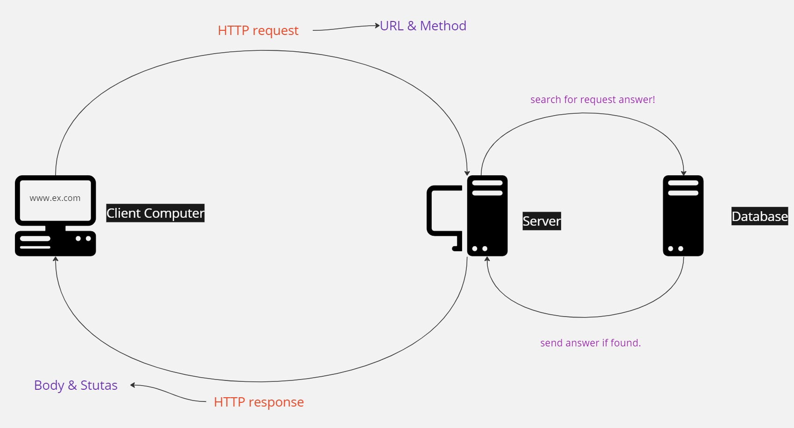

# Movies-Library - V 1.4

**Author Name**: Abdullah Kadad

## WRRC

## Overview

A Node-Express server that has several routes, each one of these routes has specific job in searching, adding or listing movies.

## Getting Started

1. Clone the repo to youe local machine.

2. Use terminal to run `npm install` to install all dependencies.

3. Use `node server.js` to run the code.

## Project Features

- '/Home' Route, Show a movie from local JSON file.

- '/favorite' Route, Response with "Welcome to Favorite Page".

- '/trending' Route, Show trending movies.

- '/search' Route, Search for movies by title and return several movies title-related.

- '/discover' Route, Return several movies by year of release-date.

- '/playingNow' Route, Returns a list of movies that are currently in theatres.

- '/addMovie' Route, Save a movies in DB.

- '/getMovies' Route, Retrieve all movies from DB or retrieve movie if it's id provided.

- '/UPDATE' Route, Update a movie comment based on id of that movie.

- '/UPDATE' Route, Delete a movie based on it's id.
